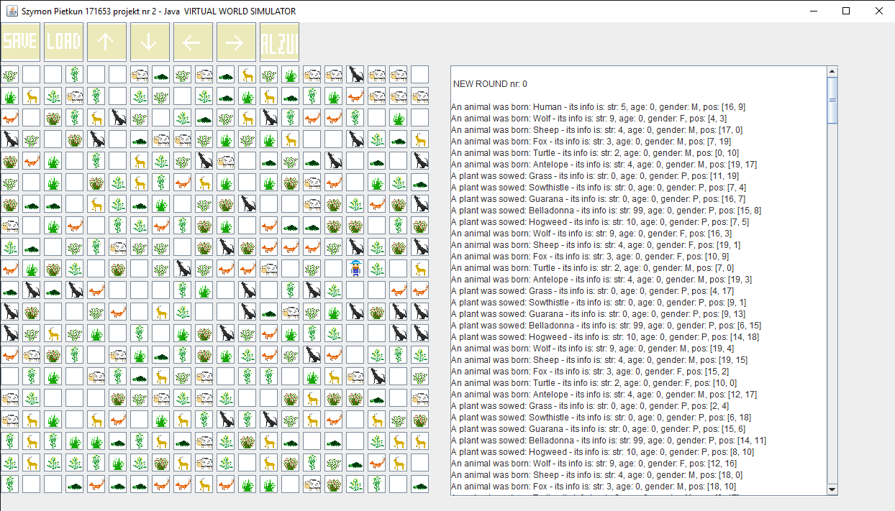

# VWS - Virtual World Simulator
## Sections

 - [Visuals](#visuals)
 - [Description](#description)
	 - [General](#general)
	 - [Rules](#rules)
		 - [Main rules](#main-rules)
		 - [Detailed rules](#detailed-rules)
	 - [Programming languages](#programming-languages)
	 - [Graphics](#graphics)
 - [Usage](#usage)
 
## Visuals

## Description

### General

**VWS** is a program that simulates a world and living organisms in it.

### Rules

#### Main rules

 - the world is a **two-dimensional board** NxM given by the user. 
 - there are simple organisms living in the world, each of them situated on one "field/tile"
 - program is **turn-based**
 - user is moving the character
 - organism interact with each other - when they are about to move to the same field there is a specified action e.g. fight or propagation
 - Organisms have its stats e.g. strength, inititative
	 - Inititative decides about move order (when equal then age is compared)
	 - Strength decides about result of the fight
- Animals can have special abilities
- User can activate special ability - "alzur shield" which protects him from any attacks for 5 turns
- game can be saved and loaded - savestate.txt file
- each turn a raport is made and shown explaing what happened in the round
- there is a possibility of controling the character movement , saving and loading the game by clicking the buttons
- there is a possibility of adding new organisms to the board by clicking an empty field and choosing one of the organisms

#### Detailed rules

**Human**

| Strength | Inititative | Action                             | Collision                                                |
|----------|-------------|------------------------------------|----------------------------------------------------------|
| 5        | 4           | user chooses direction of the move | alzur shield - protects from being  attacked for 5 turns |

**Animals**

| ID | Animal   | Strength | Inititative | Action                   | Collision                                                                        |
|----|----------|----------|-------------|-------------------------------------------------------------|----------------------------------------------------------------------------------|
| 1  | wolf     | 9        | 5           | x                                                           | x                                                                                |
| 2  | sheep    | 4        | 4           | x                                                           | x                                                                                |
| 3  | fox      | 3        | 7           | won't move to the field with an animal with higher strength | x                                                                                |
| 4  | turtle   | 2        | 1           | 75% chance of not moving | Resists attacks of attack with strength < 5 Attacker must come back to its field |
| 5  | antelope | 4        | 4           | move range is 2          | 50% chance of fleeing before fight - then move to the nearby empty field         |

**Plants**

| ID | Plant      | Strength | Action                             | Collision                           |
|----|------------|----------|------------------------------------|-------------------------------------|
| 1  | grass      | 0        | x                                  | x                                   |
| 2  | sowthistle | 0        | 3 attemps of propagation in 1 turn | x                                   |
| 3  | guarana    | 0        |                                    | Increases animal's strength by 3    |
| 4  | belladonna | 99       |                                    | Eating it results in animal's death |
| 5  | hogweed    | 10       | kills all nearby animals           | Eating it results in animal's death |

### Programming languages

 - C++ (objective)
 
### Graphics

Graphics that symbolize organisms:

are consequently:

| organisms |
|------------|
| wolf          |
| sheep          |
| turtle          |
| antelope          | 
| grass  |
| sowthistle | 
| guarana    | 
| belladonna |
| hogweed   |

- s - save current state 
 - l - load saved state 
 - a - activate alzur shield

## Usage

 - university project
 - practising objective thinking
